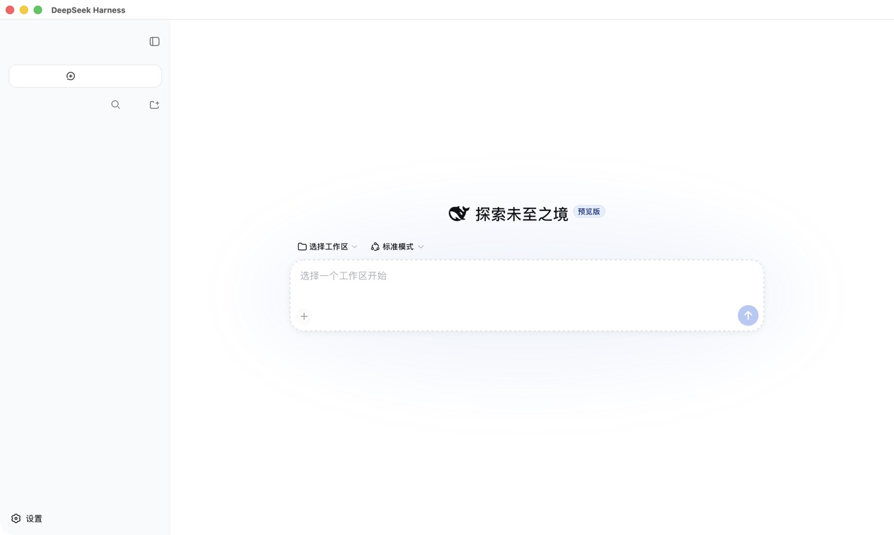

# DeepSeek Harness Terminator

**把本地 DeepSeek Harness 变成像 Codex 一样可直接打开的桌面工作台：服务留在 Mac 本机，并把内置浏览器、语音输入、标签页、分屏和安全启动检查放进一个窗口。**

语言 / Language: 简体中文 · [English](README.md)

本仓库包含 **DeepSeek Harness Terminator** 原生 AppKit/WebKit macOS 外壳，用于运行开源的
[DeepSeek Harness](https://github.com/deepseek-ai/deepseek-harness)。它会按需启动或
连接用户自行管理的本地 DSH 服务，并在原生 macOS 窗口中显示；外部链接才交给系统
浏览器，Harness 本身不会作为普通网页打开。

[English](README.md) · [上游与范围](UPSTREAM.md) · [许可证](LICENSE)

## 实际界面

隔离的本机会话中运行的 DeepSeek 官方 DSH Web runtime：


同一个本地 runtime 显示在原生 macOS 外壳中：



图片均为源分辨率无损 PNG，不使用二次压缩的缩略图。[截图记录](docs/images/README.md)
列出了捕获来源、尺寸、哈希和隐私规则。仓库中的 Windows 图片由真实 `windows-2025`
x64 Runner 生成，并在逐张目检后发布。

### 高清界面导览

仓库还附带不含凭据的高清流程截图：

| 首次配置 | 模型设置 | 插件列表 |
| --- | --- | --- |
|  |  |  |

API 密钥输入框均为空。这些图片只用于文档展示，不是任何用户 profile 或会话的副本。

[Windows 中文界面教程](windows/README.zh-CN.md)还包含真实 x64 环境下的无凭据首次配置、
空白工作区、模型设置、插件列表和机器可读的截图哈希记录。

## 包含内容

- 以 DeepSeek Harness Terminator 为品牌的原生 Swift AppKit 窗口和现有 DeepSeek Harness 视觉外壳。
- 一个可快速本地试用的 Apple Silicon `DeepSeekHarness.app` 预构建版本。
- 仅允许访问本地 Harness 地址（`127.0.0.1` / `localhost`）的 WebKit 视图。
- 按需启动本地 DSH 进程的 LaunchAgent 配置模板。
- 启动前检查 profile 的完整性，发现宿主 DSH 核心包的影子副本时安全停止。
- Windows 配套启动器，以及便携 ZIP 和 NSIS 发布目标。
- 中文 macOS 菜单、启动状态和错误提示。
- App 图标源文件和可复现构建脚本。

不包含：DeepSeek API 密钥、个人电话号码或邮箱、npm 依赖、用户会话、日志、私有
设置，也不包含之前的独立插件集合。请自行安装和配置 DSH 运行时。Windows 配套包只是
官方 Web runtime 的启动器，不是 macOS 专用原生控制插件的 Windows 移植版。

## 内置浏览器

除了主会话窗口，本应用自带一个**内置浏览器面板**（快捷键 `Cmd+B` 打开/收起），用于在
不离开应用的前提下实时浏览网页。它与截图预览不同：面板里的 `WKWebView` 会**实时渲染**
并交互当前页面，页面按原方向、原角度显示，不旋转、不缩放变形。

设计要点（对应需求）：

- **实时渲染，非截图**：面板直接加载网页，是可与网页互动的实时视图，随网页内容即时更新。
- **不抢前台**：打开面板用 `orderFront` 而非 `makeKeyAndOrderFront`，默认不调用
  `NSApp.activate(ignoringOtherApps:)`；面板设置为 `.utilityWindow` 且
  `becomesKeyOnlyIfNeeded = true`，只有你主动点击地址栏或面板内容时才成为 key 窗口，
  不会让应用夺走其他软件的前台焦点。
- **半重叠悬浮**：面板是独立的辅助窗口，可悬浮在主窗口之上并按需调整位置与大小，不改变
  页面渲染的方向与角度。
- **内部联动**：`http`/`https`/`view-source` 等在面板内打开；其余协议（如 `mailto`）交给
  系统默认应用处理；后台/新窗口请求一律在面板内加载，不会弹出额外窗口抢前台。
- **地址栏可直接搜索**：在地址栏输入网址会直接打开，输入非网址的内容（如“Apple 钱包”）会
  自动在面板内打开默认搜索引擎的结果页——无需另开外部浏览器，也不依赖 DeepSeek 官方网络
  搜索 API。内置搜索与 DeepSeek 官方 `web_search` 相互独立。

内置浏览器由 Apple 的开源 WebKit 浏览器引擎（`WKWebView`）提供渲染能力，协议说明见
`NOTICE` 文件的「Third-party notice: WebKit」。

### 书签与最近访问（本地优先）

面板工具栏的 **☆/★** 按钮可收藏/取消收藏当前页（书签与最近访问存放在本机
`UserDefaults`，`BrowserSessionStore` 纯 Foundation 逻辑，数据不出本机）。加载过的页面
会记入最近访问历史，为后续命令/查找栏检索做准备。竞品调研与需求缺口分析见
`docs/competitive-analysis.md` 与 `docs/requirements-gap-analysis.md`。

### 生产级功能路线图（G1–G14，已全部落地）

基于竞品调研与需求缺口分析，缺口清单 G1–G14（除 **G13 跨设备同步** 明确不做、以保护
「本地优先」差异外）已全部实现并在内置浏览器中可用：

| 功能 | 快捷键 | 说明 |
| --- | --- | --- |
| 命令栏（查找书签/最近访问/命令） | `⌘T` | 按标题/副标题/域名模糊检索，`/` 前缀进入命令模式（G8），键盘上下选择、回车执行 |
| 站内查找 | `⌘F` | 在面板当前页实时查找，上一/下一匹配与回绕 |
| AI 总结当前页 | `⌘⇧Y` | 取当前页标题+URL+正文，生成总结提示词复制到剪贴板并聚焦本地 DSH |
| 聚焦地址栏 | `⌘L` | 跳转并全选地址栏 |
| 新建/关闭标签页 | `⌘N` / `⌘W` | 新建、关闭当前标签页 |
| 选择标签页 | `⌘1-9` / `⌘0` | 按下标选标签，`⌘0` 选最后一个 |
| 下一个标签页 | `⌃⌘Tab` | 依次切换标签 |
| 按站点分组标签 | `⌘⇧G` | 按站点（host）聚合标签并加组名前缀 |
| 垂直多标签栏（折叠） | `⌘⇧G` 分组内 | 组内折叠/展开，折叠组从标签栏隐藏 |
| 分屏视图 | `⌘⇧S` | 右侧副屏加载当前页，联动查看 |
| 会话恢复 | 退出时自动 | 标签集 + 选中项 + 滚动位置下次启动恢复 |
| 保存当前页截图 | 菜单 | 按标题生成合法文件名，快照 PNG 存到下载目录 |
| 用户脚本（站点定制） | 菜单/`WKUserScript` | 按 URL 通配匹配注入脚本，增删改 + 启停 |
| 鼠标手势（面板内） | 菜单 | 面板内拖拽量化方向 → 前进/后退/刷新，不抢前台 |

这些逻辑（查找、检索、总结提示词、分组、分屏、会话恢复、截图命名、用户脚本匹配、手势量化、
快捷键映射）都拆成纯 Foundation 深模块，逐一由 `swiftc` 契约测试覆盖（`tests/` 下每个模块的
`*.test.swift`），可独立验证、不易回归。测试工程师质量复查见 `docs/qa-review.md`。

### 浏览器面板的 UI 状态反馈与可访问性

面板底部有一根纤细的页面状态条（`就绪` / `加载中…` / 简短失败原因如 `无网络连接`），
长时间加载或页面失败不再「无声无息」。工具栏每个按钮（后退/前进/刷新/主页/麦克风）
都带 `toolTip` 与可访问标签，地址栏也有标签，因此面板对键盘与 VoiceOver 友好。
面板依旧不抢前台：如以往用 `orderFront` 出现，只有你点击面板内部才成为 key window。

### 语音输入（macOS 原生、离线）

无需离开 App 即可向当前输入框口述：

- **菜单**：*DeepSeek Harness → 语音输入*（`⌘⇧M`），或内置浏览器面板工具栏的 **🎤** 麦克风按钮。
- **原理**：本机 `SFSpeechRecognizer`（zh-CN / en-US）本地转写，再经剪贴板桥粘贴到当前聚焦的
  输入框。音频不离开你的 Mac。
- **状态反馈**：麦克风按钮 / 菜单项反映状态（`待命` → `正在聆听` → `正在输入`），
  权限或可用性失败时置灰并给出原因。
- **权限**：首次使用会请求麦克风与语音识别权限；两个用途说明已声明在 `Info.plist`。
  请在「系统设置 → 隐私与安全性」授予这两项，否则语音入口保持禁用。

语音输出不在此重复实现：DSH 运行时已通过其自带 `@dsh-voice`（`speak`，底层 macOS `say`）
朗读回复。

## 构建与安装

要求：Apple Silicon macOS 12 或更高版本、Xcode Command Line Tools、Node.js 22 或更高
版本，以及本地 DeepSeek Harness 运行时。

```bash
zsh ./scripts/build-app.sh \
  --dsh-runtime /绝对路径/dsh-runtime \
  --install
```

脚本会编译 Swift 外壳、生成 `DeepSeekHarness.app`，按照你提供的运行时路径生成当前
用户的 LaunchAgent，并安装到 `~/Applications/DeepSeek Harness Terminator.app`。它不会复制 API 密钥
或插件。

仅构建不安装：

```bash
zsh ./scripts/build-app.sh --dsh-runtime /绝对路径/dsh-runtime
```

本公开仓库采用标准源码目录：构建入口为 `scripts/build-app.sh`，Swift 源码位于
`App/DeepSeekHarnessApp`，LaunchAgent 模板位于 `packaging`。脚本仍兼容旧的扁平
导出布局。使用 `zsh` 调用，可以避免下载源码归档未保留可执行位时构建失败。

完整步骤见 [中文可复现构建教程](TUTORIAL.zh-CN.md)，英文教程见
[TUTORIAL.md](TUTORIAL.md)。

## Windows 配套环境

Windows 10/11 x64 通过 `windows/` 配套包支持。它启动 `@deepseek-ai/dsh` 并打开本地
Web UI，不宣称在 Windows 上提供 macOS 的 Automation/Accessibility 工具。在 Windows
构建机上先运行 `windows/bootstrap-build-environment.ps1`，再用
`windows/build-release.ps1` 生成便携 ZIP、NSIS 当前用户安装包和 SHA-256 校验文件。
GitHub Actions 会在真实的 `windows-2025` runner 上运行同样的构建并上传产物。

安装 Release 前请阅读 [Windows 指南](windows/README.zh-CN.md)，英文说明见
[Windows guide](windows/README.md)。

Windows 指南语言：[日本語](windows/README.ja.md) ·
[한국어](windows/README.ko.md) · [Español](windows/README.es.md) ·
[Français](windows/README.fr.md) · [Deutsch](windows/README.de.md) ·
[Português](windows/README.pt-BR.md) · [Русский](windows/README.ru.md) ·
[العربية](windows/README.ar.md) · [हिन्दी](windows/README.hi.md) ·
[繁體中文](windows/README.zh-TW.md)。

## 运行行为

只有本地服务就绪后，App 才会连接 `http://127.0.0.1:3080/`。关闭 App 会请求终止关联的
LaunchAgent 进程。外部链接交给系统浏览器，Harness 界面始终留在原生窗口内。

每次由 App 管理启动时，`profile-doctor.mjs` 都会把当前 profile 与实际 runtime 对照。
只要插件另装了一份宿主 `@deepseek-ai/dsh-*` 核心包，即使版本号相同也会被阻止，因为
Cordis 服务可能使用仅在当前物理副本中相同的 `Symbol`。检查器会指出冲突包和引入者，但
绝不自动删除文件。如果旧会话已经写入 `tool_calls` 却没有对应工具结果，请保留它作为
历史记录，并在新会话中重新发送任务，不要继续点击旧会话的“继续”。

## 上游归属与法律说明

本项目是名为 **DeepSeek Harness Terminator**、基于 **DeepSeek AI** 开源 **DeepSeek Harness** 开发的独立原生外壳，与
DeepSeek AI 没有隶属、赞助、代理或官方背书关系。上游项目仍按 MIT 协议独立授权；详见
[NOTICE](NOTICE) 与 [UPSTREAM.md](UPSTREAM.md)。

## 协议

本仓库中的 App 外壳和打包文件采用 [MIT License](LICENSE)。中文参考译文见
[LICENSE.zh-CN](LICENSE.zh-CN)；如有解释冲突，以英文 `LICENSE` 为准。
