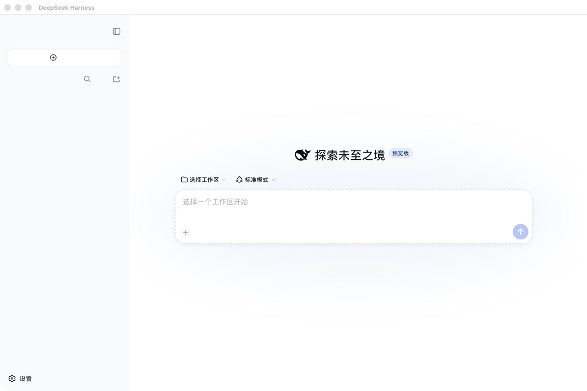

# DeepSeek Harness Terminator: Reproducible Build Tutorial

Language / 语言: [简体中文](TUTORIAL.zh-CN.md) · English

This tutorial builds the native shell from source and connects it to a local
DeepSeek Harness runtime. It does not fetch or embed API keys, plugins, user
sessions, or logs.

## 1. Requirements

- Apple Silicon Mac with macOS 12 or later
- Xcode Command Line Tools (`xcode-select --install`)
- Node.js 22 or later
- A local DSH runtime with `@deepseek-ai/dsh/lib/bin.js`

Verify the tools:

```bash
swiftc --version
node --version
```

## 2. Prepare the runtime

Install DeepSeek Harness separately and record its absolute runtime directory.
For an existing local runtime:

```bash
cd /absolute/path/to/dsh-runtime
test -f node_modules/@deepseek-ai/dsh/lib/bin.js
```

An empty, isolated runtime should render like this before any workspace,
account, or credential is added:


The following high-resolution frames show the safe onboarding path. The API-key
field is blank in the public fixture; enter your key only in your local runtime
settings and never paste it into a repository file.




Configure your provider and API key in the runtime's own settings. Never put
credentials in this repository, a commit, a screenshot, or an issue report.

## 3. Build

This repository uses a standard nested source tree. From the repository root,
run:

```bash
zsh ./scripts/build-app.sh \
  --dsh-runtime /absolute/path/to/dsh-runtime \
  --output ./build
```

The output is `build/DeepSeekHarness.app`. The script compiles `main.swift`,
copies the plist and icon, and does not modify the DSH runtime.

Calling the script through `zsh` avoids relying on the executable bit, which a
source archive may not preserve. The same script still detects the old flat
export layout for backward compatibility.

## 4. Install and launch

```bash
zsh ./scripts/build-app.sh \
  --dsh-runtime /absolute/path/to/dsh-runtime \
  --install
open "$HOME/Applications/DeepSeek Harness Terminator.app"
```

The native shell should display the same local DSH workspace inside a macOS
window:


For a quick UI tour, open settings and verify the model panel reports only
whether a provider is configured; it must never reveal the stored key. The
public model and plugin examples below are intentionally credential-free:


The LaunchAgent is generated at
`~/Library/LaunchAgents/com.houxinran.deepseek-harness.plist`; logs go to
`~/Library/Logs/DeepSeekHarness.log`.

The generated LaunchAgent runs the bundled profile doctor before DSH. You can
run the same check without launching the app:

```bash
node scripts/profile-doctor.mjs \
  --runtime /absolute/path/to/dsh-runtime \
  --profile-dir "$HOME/.dsh/profiles/web"
```

Do not remove the guard to make a conflict disappear. Upgrade or remove the
reported plugin, or fix that plugin so host core packages are in
`peerDependencies` rather than `dependencies`.

### Using the built-in browser

The app includes a **built-in browser panel** toggled with `Cmd+B`. It is a
**live-rendered** `WKWebView` view (not a screenshot), displayed at the page's
original direction and angle. The panel is a `.utilityWindow` shown with
`orderFront` (not `makeKeyAndOrderFront`), with `becomesKeyOnlyIfNeeded = true`
and no `NSApp.activate(ignoringOtherApps:)` call — so it **never steals focus**
from the frontmost application; it only becomes the key window when you click the
address field or panel content.

- Type a URL in the address bar and press Return. `http`/`https`/`view-source`
  open in-panel; other schemes are handed to the system default app.
- Type anything else (e.g. `Apple Wallet`) to search right in the address bar —
  the panel loads the default search engine's results page, no external browser.
- Background/new-window requests load in-panel, so no extra window steals focus.
- A slim status bar at the bottom shows `就绪` / `加载中…` / failure reasons;
  every toolbar button has a tooltip and accessibility label.
- **Dictate into the active input field**: *DeepSeek Harness → 语音输入* (`⌘⇧M`)
  or the 🎤 button in the browser panel. Transcription runs on-device (zh-CN /
  en-US) and pastes into the focused input. First use asks for microphone and
  speech-recognition permission in System Settings → Privacy.
- Rendering is powered by Apple's open-source WebKit (`WKWebView`); see `NOTICE`
  for licensing details.

## 5. Verify reproducibility

Check that the generated app is an Apple Silicon executable and that its plist
is valid:

```bash
file build/DeepSeekHarness.app/Contents/MacOS/DeepSeekHarness
plutil -lint build/DeepSeekHarness.app/Contents/Info.plist
```

A successful verification reports a Mach-O 64-bit arm64 executable and an
`OK` result from `plutil`.

The app should connect only to `http://127.0.0.1:3080/`. External links should
open in the system browser. If the local service is not ready, the app shows a
Chinese startup status and retries before presenting the log location.

## 6. Windows companion setup

The Windows package is a separate launcher for the official DSH Web runtime. It
does not include the runtime or credentials, and it does not make the
macOS-only `dsh-mac-control` tools available on Windows. Requirements are
Windows 10/11 x64, PowerShell 5.1 or 7, and `winget` for the bootstrap script.

From a checkout, prepare a Windows build machine:

```powershell
Set-Location windows
& .\bootstrap-build-environment.ps1
```

The script installs Git, Node.js LTS, and NSIS through `winget`, then creates a
separate `$HOME\dsh-runtime` with `@deepseek-ai/dsh@0.1.0-rc.7`. Review the
commit-pinned plugin command in the main repository tutorial before adding any
plugin to the Windows `web` profile. Reopen PowerShell after an installer
changes `PATH`.

Build the release artifacts on Windows:

```powershell
& .\build-release.ps1 -Version 0.1.1
```

The output contains `DeepSeek-Harness-Windows-x64-v0.1.1.zip`,
`DeepSeek-Harness-Setup-v0.1.1-x64.exe`, and a `.sha256` manifest. The NSIS
installer is per-user and does not require administrator rights. The portable
archive contains `launch-dsh.cmd`, `launch-dsh.ps1`, install/uninstall scripts,
12 selectable language guides, and the MIT license.

Start the installed launcher with:

```powershell
& "$env:LOCALAPPDATA\DeepSeek Harness Terminator\launch-dsh.ps1" `
  -DshRuntime "$HOME\dsh-runtime" -Port 3080
```

It waits for `127.0.0.1:3080`, opens the default browser, writes logs to
`%LOCALAPPDATA%\DeepSeek Harness Terminator\logs`, and stops the child DSH process when
the launcher exits. Use `-NoBrowser` for headless startup. GitHub Actions uses
the same `windows/build-release.ps1` on a `windows-2025` runner and uploads the
ZIP, installer, hash file, and an isolated set of `1600x1000` documentation
screenshots. The committed Windows evidence below was generated from a fresh
Chromium profile, visually reviewed, and contains no credentials:

| Clean onboarding | Empty workspace |
| --- | --- |
|  |  |

See the [complete Windows walkthrough](windows/README.md) for model and plugin
screenshots plus the machine-readable screenshot proof.

The Windows launcher runs the same physical-copy check against
`%DSH_HOME%\profiles\<profile>` (or `%USERPROFILE%\.dsh\profiles\<profile>`)
before opening the port. It reports the package and owner and leaves the
profile untouched.

## Troubleshooting

If startup fails, inspect the log and validate the runtime path:

```bash
tail -100 "$HOME/Library/Logs/DeepSeekHarness.log"
test -x "$(command -v node)"
test -f /absolute/path/to/dsh-runtime/node_modules/@deepseek-ai/dsh/lib/bin.js
```

If port 3080 is occupied, stop the conflicting local service or adapt the App
shell and LaunchAgent together. Do not hard-code another user's path into a
public commit.

For Windows, inspect `%LOCALAPPDATA%\DeepSeek Harness Terminator\logs`, verify that
`node_modules\@deepseek-ai\dsh\lib\bin.js` exists under the runtime directory,
and confirm that NSIS is installed when an installer build fails. Do not copy
the macOS LaunchAgent or `osascript` commands into Windows scripts.

If the API reports that an assistant `tool_calls` message lacks following tool
messages after a profile conflict, that session already contains an incomplete
turn. Preserve it for reference and resend the task in a new session after the
dependency check passes.
