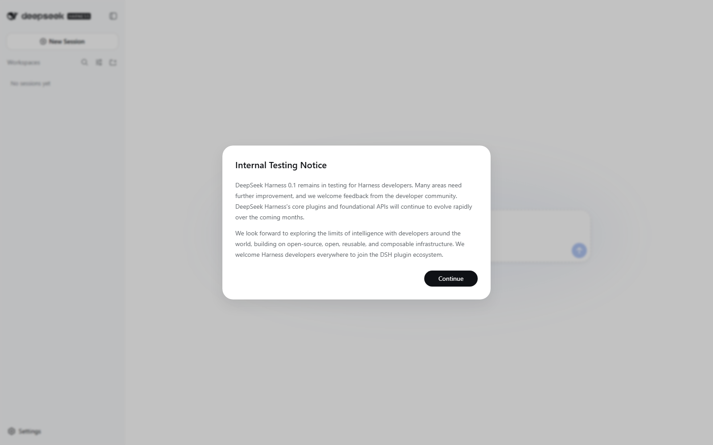
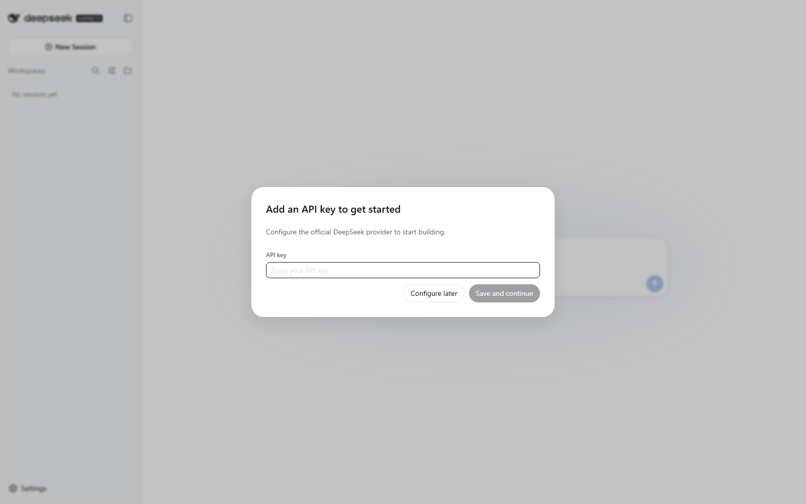
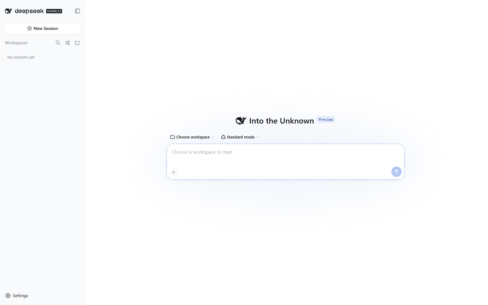
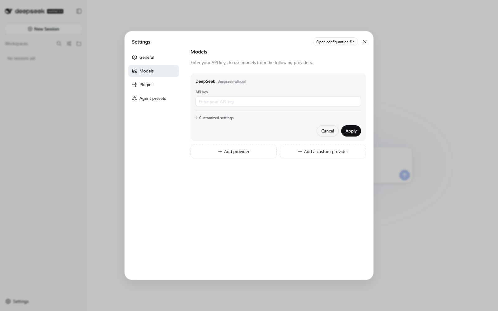

# DeepSeek Harness Terminator Windows 启动器

**语言：** 简体中文 · [English](README.md) · [日本語](README.ja.md) · [한국어](README.ko.md) · [Español](README.es.md) · [Français](README.fr.md) · [Deutsch](README.de.md) · [Português](README.pt-BR.md) · [Русский](README.ru.md) · [العربية](README.ar.md) · [हिन्दी](README.hi.md) · [繁體中文](README.zh-TW.md)

这是独立 DeepSeek Harness macOS 外壳的 Windows 配套包。它启动官方 `@deepseek-ai/dsh` Web runtime，并在默认浏览器打开 `http://127.0.0.1:<port>`。它不是 DeepSeek 官方桌面应用，也不包含 DSH runtime、API Key、profile、浏览器会话或仅适用于 macOS 的 `dsh-mac-control` 插件。

## 环境要求

- Windows 10 或 Windows 11 x64
- 推荐 Node.js 22 LTS（本启动器支持 20 或更高版本）
- 一个包含 `node_modules\@deepseek-ai\dsh\lib\bin.js` 的本地 DSH runtime
- PowerShell 5.1 或 PowerShell 7

## 安装

执行 `install.ps1` 可进行当前用户安装，也可以使用 GitHub Release 中经过审阅的 NSIS 安装包。如果 Windows 阻止下载的脚本，可执行 `Unblock-File .\install.ps1`，或只对当前 PowerShell 窗口设置 `Set-ExecutionPolicy -Scope Process Bypass`。当前工作流不会对可执行文件进行代码签名；运行前请核对发布的 SHA-256 文件。安装器只写入 `%LOCALAPPDATA%\DeepSeek Harness Terminator` 并创建开始菜单快捷方式，不要求管理员权限。

## 快速路径：干净首次运行

从新检出的仓库开始，下面几条命令会安装构建依赖、创建独立 runtime、隔离 DSH profile，并启动本地 Web UI：

```powershell
Set-Location .\deepseek-harness-terminator
Set-ExecutionPolicy -Scope Process Bypass
& .\windows\bootstrap-build-environment.ps1 -DshRuntime "$HOME\dsh-runtime"
$env:DSH_HOME = Join-Path $env:TEMP "deepseek-harness-terminator-profile"
& .\windows\launch-dsh.ps1 -DshRuntime "$HOME\dsh-runtime" -Port 3080
```

最后一条命令会保持前台运行。另开一个 PowerShell 窗口验证服务，不会发送凭据：

```powershell
$response = Invoke-WebRequest -UseBasicParsing http://127.0.0.1:3080/
if ($response.StatusCode -ne 200 -or $response.Content -notmatch 'window\.__DSH_BOOT__') {
  throw "没有返回 DSH Web 启动清单。"
}
"DSH Web runtime 已就绪。"
```

首次运行会打开官方 onboarding 页面。为了做无凭据冒烟测试，请选择“稍后配置”。真正配置 provider 时，只在本机 runtime 设置中填写密钥，绝不要写入仓库或截图。

要一次性准备 Windows 构建环境并安装官方 runtime，请在 PowerShell 中执行：

```powershell
Set-Location windows
& .\bootstrap-build-environment.ps1
```

该脚本通过 `winget` 安装 Git、Node.js LTS 和 NSIS。如果 Windows 尚未刷新 `PATH`，请重新打开 PowerShell。若 runtime 由其他方式管理，可使用 `-SkipDshRuntime`。脚本不会安装凭据或 profile。

## 配置官方 runtime

在 PowerShell 中执行：

```powershell
New-Item -ItemType Directory -Force "$HOME\dsh-runtime" | Out-Null
Set-Location "$HOME\dsh-runtime"
npm init -y
npm install --save-exact @deepseek-ai/dsh@0.1.0-rc.7
node node_modules\@deepseek-ai\dsh\lib\bin.js web --port 3080
```

将本仓库插件加入 DSH `web` profile 前，请先审阅主教程中的提交固定命令。插件的浏览器和桌面工具目前是 macOS 专用；Windows 上请使用官方 DSH Web 界面，以及你另外审阅过的 Windows 原生工具。每次复现建议使用干净 profile：

```powershell
$env:DSH_HOME = Join-Path $env:TEMP "deepseek-harness-terminator-profile"
New-Item -ItemType Directory -Force $env:DSH_HOME | Out-Null
```

## 启动

```powershell
& "$env:LOCALAPPDATA\DeepSeek Harness Terminator\launch-dsh.ps1" -DshRuntime "$HOME\dsh-runtime" -Port 3080
```

启动器会拒绝已被占用的端口，等待本机端口就绪后打开浏览器，把按端口区分的日志写入 `%LOCALAPPDATA%\DeepSeek Harness Terminator\logs`，并在启动器退出时停止子 runtime。无头启动使用 `-NoBrowser`。自定义 `-Profile` 只有在经审计的组合中包含官方 Web app 且接受 `--port` 时才有效，否则请保持默认 `web` profile。

## Windows 界面步骤

以下图片均以 `1600x1000` 分辨率，从真实 GitHub Actions `windows-2025` x64 runner
中的全新 Chromium profile 捕获。API Key 输入框有意留空，profile 中没有用户会话。

1. 阅读并确认上游开发者预览说明。

   

2. 无凭据 smoke test 请点击 **Configure later**；真正的 API Key 只应在自己的本地
   runtime 设置中填写。

   

3. 确认空白工作区正常显示，没有裁切或错位。

   

4. 打开 **Settings → Models** 配置供应商；打开 **Settings → Plugins → Plugin list**
   检查隔离 runtime 的插件。

| 模型设置 | 插件列表 |
| --- | --- |
|  |  |

机器可读的来源、尺寸、文件大小和哈希记录位于
[`windows-screenshot-proof.json`](../docs/images/windows/windows-screenshot-proof.json)。不要使用
个人 profile 或含 API Key 的截图替代这些素材。

## 构建发布包

在安装 NSIS 的 Windows 环境中执行：

```powershell
Set-Location windows
& .\build-release.ps1 -Version 0.1.1
```

这会生成便携 ZIP、NSIS 当前用户安装包和 SHA-256 校验文件，同时验证 ZIP 内容、12 种语言指南、安装器的 Windows 可执行文件头和哈希。GitHub Actions 会在真实 `windows-2025` runner 上执行同样的构建，启动 `@deepseek-ai/dsh@0.1.0-rc.7`，并且只有在 HTTP 200 与官方 `window.__DSH_BOOT__` 启动清单同时通过时才上传产物。

本地复现发布包时，请将 ZIP 解压到新的临时目录，执行
`install.ps1 -InstallDirectory "$env:TEMP\\dht-install"`，再用同一个隔离的 `DSH_HOME` 启动复制后的
`launch-dsh.ps1`。源码 checkout 与便携包必须报告相同的 loopback 地址、profile 检查结果和 HTTP
启动清单。NSIS 安装器按当前用户安装，不需要管理员权限。

运行下载的产物前，请将它的哈希与对应 `.sha256` 文件中的行比较：

```powershell
Get-FileHash .\DeepSeek-Harness-Setup-v0.1.1-x64.exe -Algorithm SHA256
Get-Content .\DeepSeek-Harness-Windows-x64-v0.1.1.sha256
```

## 卸载

```powershell
& "$env:LOCALAPPDATA\DeepSeek Harness Terminator\uninstall.ps1"
```

该脚本只删除启动器和快捷方式，不会删除单独管理的 DSH runtime 或 profile。

## Profile 完整性检查

DSH 启动前，启动器会将所选 profile 与实际 runtime 对照，并阻止宿主
`@deepseek-ai/dsh-*` 包的第二个物理副本。报告会指出冲突包和引入者，但不会删除
profile 文件。修复插件后，请在新会话中重新发送中断的任务，因为旧会话可能已经保存
了没有对应工具结果的 `tool_calls` 消息。
